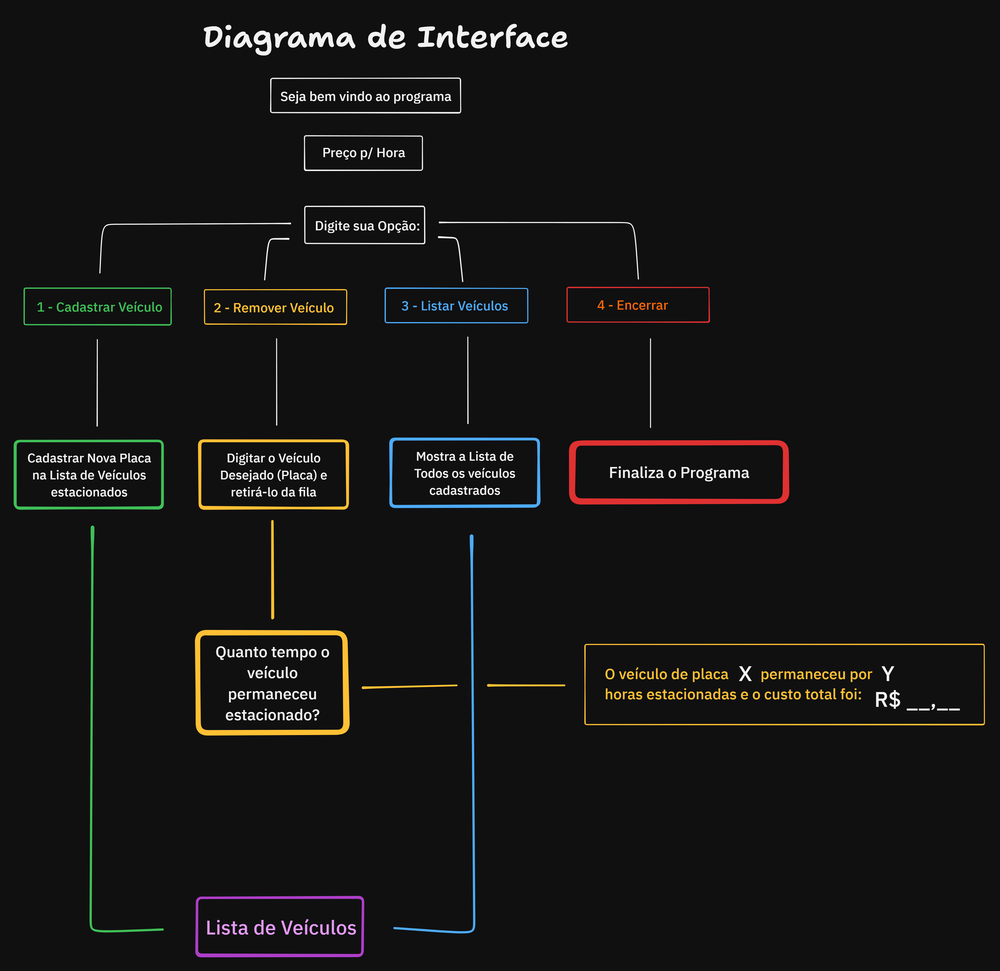

# DIO - Trilha .NET - Fundamentos
Construção de um sistema de estacionamento em C#.

## Contexto
Você foi contratado para construir um sistema para um estacionamento, que será usado para gerenciar os veículos estacionados e realizar suas operações, como por exemplo adicionar um veículo, remover um veículo (e exibir o valor cobrado durante o período) e listar os veículos.

## Diagrama Demonstrativo de Interface
Fluxograma que demonstra as Opções disponibilizadas e suas respectivas funções.

## Prints de Execução: