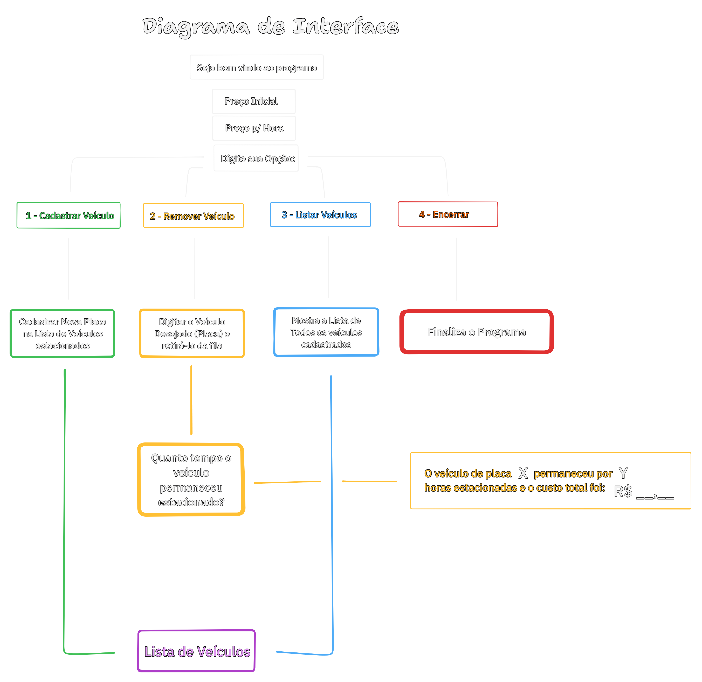

# DIO - Trilha .NET - Fundamentos
Construção de um sistema de estacionamento em C#.

## Contexto
Você foi contratado para construir um sistema para um estacionamento, que será usado para gerenciar os veículos estacionados e realizar suas operações, como por exemplo adicionar um veículo, remover um veículo (e exibir o valor cobrado durante o período) e listar os veículos.

## Diagrama Demonstrativo de Interface
Fluxograma que demonstra as opções disponibilizadas e suas respectivas funções.

## Prints de Execução:

### Interface Inicial:
Primeira tela, onde é solicitado ao usuário escolher entre as 4 opções oferecidas.

### 1: Adicionar Veículo
Nesta etapa, é informada a placa do veículo, com verificação regex e remoção de hífens inseridos (Sistema aceita placas no padrão mercosul onde o antigo 2° numeral pode ser trocado por uma letra).

### 2: Remoção do Veículo
Informada a placa do veículo para remover da lista de automóveis estacionados. Em seguida, calculado o valor total cobrado ao proprietário teórico do veículo.

### 3: Lista de Veículos
Apresenta a lista de veículos cadastrados até o presente momento.

### 3.1: Lista sem Veículos

### 3.2: Lista com Veículos

## 4: Finalização do Programa
